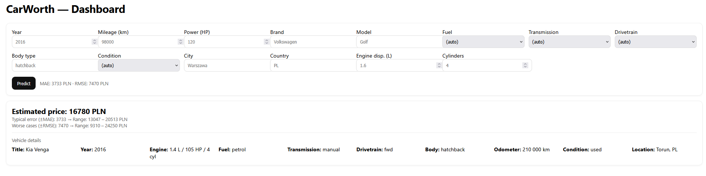

# CarWorth-ML 🚗💸


[](https://github.com/SculptTechProject/CarWorth-ML/blob/main/LICENSE)
[](./LICENSE)

Predict used-car prices (PLN) from tabular specs like mileage, year, engine, transmission, drivetrain, make/model, etc.
Built with scikit-learn pipelines (imputation + One-Hot), `HistGradientBoostingRegressor`, a log-transformed target for stability, and a ready-to-run **FastAPI** service with a lightweight **/dashboard**.

---

## 🔥 Features

- **Preprocessing pipeline**: numeric & categorical, missing-value imputation, OneHot (`handle_unknown="ignore"`).
- **Model**: `HistGradientBoostingRegressor` wrapped in `TransformedTargetRegressor` (log target).
- **Evaluation**: MAE & RMSE (+ optional 5-fold OOF CV).
- **Reports**: parity, residuals, histogram, permutation importance (saved to `reports/`).
- **API**: `/predict`, `/health`, and a Jinja2 **/dashboard** showing the estimate with ±MAE/±RMSE bands.
- **Artifacts**: model saved as `models/*.joblib` + `*.meta.json` (columns + metrics).
- **Docker Compose**: train and serve with one command.

---

## 🗂 Project Structure

```
.
├── data/                    # input CSV (e.g., cars\_5m.csv.gz)
├── models/                  # trained models + meta.json
├── reports/                 # evaluation plots
├── src/                     # ML code (main.py, pipeline.py, \_helpers.py)
├── app/                     # FastAPI app (main.py, templates/)
├── docker-compose.yml       # train + api services
├── requirements.txt
└── README.md
```

---

## ⚡ Quick Start (Docker)

**1) Train the model (once):**

```bash
docker compose run --rm train
```

**2) Run only the API + dashboard:**

```bash
docker compose up -d api
# open http://localhost:8001/dashboard
```

**3) Or run everything:**

```bash
docker compose up --build
```

> If a model file already exists, training is skipped. Use `--force` to retrain.

---

## 🧪 Local Dev (no Docker)

```bash
python -m venv .venv && source .venv/bin/activate
pip install -r requirements.txt

# train
python -m src.main --data data/cars_5m.csv.gz --out models/carworth_hgbr_v1.joblib --plots

# serve
uvicorn app.main:app --reload --port 8001
```

Key flags for `src.main`:

* `--data <path>` – input CSV
* `--out <path>` – output model `.joblib`
* `--plots` – save plots into `reports/`
* `--cv` – 5-fold OOF (can be heavy for big data)
* `--force` – retrain even if a model exists

---

## 🌐 API

### `POST /predict`

Request (API names are mapped to training names):

* `brand → manufacturer`
* `mileage_km → odometer_km`
* `power_hp → engine_power_hp`
* `car_age` is derived from `year` automatically.

```json
{
  "year": 2016,
  "mileage_km": 98000,
  "power_hp": 120,
  "brand": "Volkswagen",
  "model": "Golf",
  "fuel": "petrol",
  "transmission": "manual",
  "drivetrain": "fwd",
  "body_type": "hatchback",
  "condition": "used",
  "city": "Warszawa",
  "country": "PL"
}
```

Response:

```json
{ "price": 27009.77 }
```

### `GET /dashboard`

Simple form UI to get a quote with ±MAE/±RMSE bands (metrics read from `*.meta.json`).



### `GET /health`

Basic info about the loaded model (file name, required columns count, API→TRAIN mapping).

**Environment variables (API):**

* `MODEL_PATH` — defaults to `/models/carworth_hgbr_v1.joblib`
* `MODEL_META` — defaults to the same path with `.meta.json`
* `METRIC_MAE`, `METRIC_RMSE` — override metrics from meta (optional)

---

## 📈 Example Results (on `cars_5m.csv.gz`)

```
Test → MAE ≈ 3,733 PLN | RMSE ≈ 7,470 PLN
```

> Exact numbers depend on the dataset; the above reflects the sample in this repo.

---

## 🖼 Reports (`reports/`)

* `parity_test.png`
* `residuals_test.png`
* `residuals_hist_test.png`
* `perm_importance_test.png`

---

## 🧩 Synthetic Data (optional)

Generate a large synthetic dataset:

```bash
python scripts/generate_cars_dataset.py \
  --rows 5_000_000 \
  --out data/cars_5m.csv.gz \
  --format csv \
  --chunksize 250_000 \
  --seed 1
```

---

## 🛠 Troubleshooting

* **`columns are missing: {...}`**
  Provide the missing fields or fix the API→TRAIN mapping; ensure imputers are in the pipeline and `OneHotEncoder(handle_unknown="ignore")` is used.
* **`*.meta.json` not found**
  Retrain with `--force` to generate meta (used by /dashboard and /health).
* **Slow CV/plots**
  Avoid `--cv/--plots` on the full 5M rows or sample down.

---

